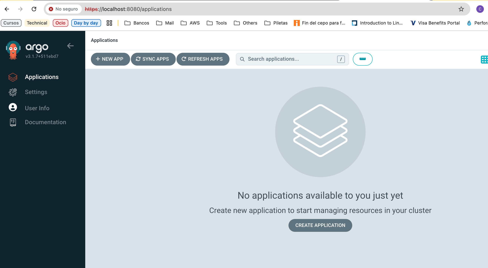

# 🏆 Guestbook App Challenge - Python, Flask, MySQL, Docker & Kubernetes

A fast web-based guestbook application built with Flask and MySQL, containerized with Docker, and deployed on Kubernetes using Helm as part of a challenge for S*****l.

## ✨ Resume

- ✅ Responsive web interface built with Flask
- ✅ MySQL database with persistence
- ✅ Containerized with Docker
- ✅ Deployed on Kubernetes using Helm
- ✅ Nginx Ingress for routing
- ✅ GitOps-ready configuration (In Progress)

## Architecture


## 🏗️ Flowchart


# 🚀 Fast Deployment

# Using Docker Compose (Development)

```shell
git clone https://github.com/chispa77/guestbook-app.git
cd guestbook-app/docker
cp .env.example .env
# Deploy using environment variables
export MYSQL_PASSWORD=[guestbook_user_password]
export MYSQL_ROOT_PASSWORD=[root_password]
docker-compose up -d
```
## 🐳 Docker Image Management

### Build and Publish the Image

1. **Build the image locally:**

```shell
docker build -t guestbook-app:1.5.0 .
```

2. **Tagging for Docker Hub:**

```shell
docker tag guestbook-app:1.5.0 chisporra77/guestbook-app:1.5.0
```

3. **Login and push to Docker Hub:**

```shell
docker login
docker push chisporra77/guestbook-app:1.5.0
```

## Multi-architecture (Apple Silicon/AMD64)

### To support multiple architectures:

```shell
docker buildx create --use
docker buildx build --platform linux/amd64,linux/arm64 -t chisporra77/guestbook-app:1.5.0 --push .
```

# Using Kubernetes (Production)

1. **Connect to K8s-interview-01 Cluster**

```shell
brew install doctl
doctl auth init -t 
doctl kubernetes cluster kubeconfig save 9e15da88-8f51-4aca-b99a-4075e8bcd281
```

2. **Dependencies**

```shell
# Create a PGP key pair
export KEY_NAME="Your name"
export KEY_COMMENT="Key for helm-secrets"

gpg --batch --full-generate-key <<EOF
%no-protection
Key-Type: 1
Key-Length: 4096
Subkey-Type: 1
Subkey-Length: 4096
Expire-Date: 0
Name-Comment: ${KEY_COMMENT}
Name-Real: ${KEY_NAME}
EOF
```

```shell
# Obtain the fingerprint of the public key, which you will need to configure SOPS
gpg --list-secret-keys "${KEY_NAME}"
```

```yaml
# .sops.yaml
creation_rules:
  - pgp: >-
      BE574406FE117762E9F4C8B01CB98A820DCBA0FC  # Replace with your fingerprint
```

### Note: To edit secrets you can use this script

```shell
./edit-secrets.sh
```

3. **Deploy app in K8s-interview-01 Cluster**

```shell
# Install Helm chart
git clone https://github.com/chispa77/guestbook-app.git
cd guestbook-app/k8s-helm
./deploy.sh 
```

4. **Access the Application**

```shell
# Get the IP address of the Ingress
kubectl get ingress -n guestbook-app
```

```shell
# Add entry to /etc/hosts (Linux/Mac)
echo "[IP address obtained] guestbook.local" | sudo tee -a /etc/hosts
```

# 💡 How to Test Endpoints

* Get messages (GET):

```shell
curl http://guestbook.local/guestbook
```

* Send a message (POST via JSON):

```shell
curl -X POST http://guestbook.local/guestbook \
-H "Content-Type: application/json" \
-d '{"name":"Chris", "message":"Testing the API!"}'
```
# 🔧 Useful commands

### View resources

```shell
# View pods in all namespaces
kubectl get pods -A
kubectl get pods --all-namespaces

# View pods in a specific namespace
kubectl get pods -n guestbook-app

# View multiple types of resources
kubectl get pods,svc,deploy -n guestbook-app

# View everything in one namespace
kubectl get all -n guestbook-app
```

### Detailed information

```shell
# Detailed description of a pod
kubectl describe pod nombre-pod -n guestbook-app

# View logs of a pod
kubectl logs nombre-pod -n guestbook-app
kubectl logs -f nombre-pod -n guestbook-app  # follow (Real Time)

# View logs for a deployment
kubectl logs deploy/nombre-deployment -n guestbook-app
```

### Services & Networking

```shell
# View services
kubectl get services -A
kubectl get svc -n guestbook-app

# Port forwarding to access services
kubectl port-forward pod/nombre-pod -n guestbook-app 5000:80
kubectl port-forward pod/mysql-pod -n guestbook-app 3306:3306
#kubectl port-forward svc/argocd-server -n argocd 8080:443

# View endpoints
kubectl get endpoints -n argocd
```

### Configmap & Secrets

```shell
# View secrets
kubectl get secrets -n guestbook-app
kubectl describe secret nombre-secret -n guestbook-app

# View configmaps
kubectl get configmaps -n guestbook-app
kubectl describe configmap nombre-cm -n guestbook-app
```

### TROUBLESHOOTING COMMANDS

```shell
# Running commands inside a pod
kubectl exec -it nombre-pod -n guestbook-app -- /bin/bash

# View events (very useful for debugging)
kubectl get events -n guestbook-app --sort-by=.metadata.creationTimestamp
kubectl get events -A --sort-by=.metadata.creationTimestamp

# View resources with wide output
kubectl get pods -n guestbook-app -o wide
kubectl get nodes -o wide

# View cluster information
kubectl cluster-info
kubectl version
```

# 🔧 ArgoCD 

## Installation

1. **Add the ArgoCD Helm repository**

```shell
helm repo add argo https://argoproj.github.io/argo-helm
helm repo update
```

2. **Create values.yaml to deploy**

```shell
#values.yaml
argo-cd:
  dex:
    enabled: false
  notifications:
    enabled: false
  applicationSet:
    enabled: false
```

3. **Deploy with Helm**

```shell
helm install argocd argo/argo-cd -n argocd -f values.yaml
```

4. **Verify the installation**

```shell
croldan@MacBook-Pro-de-Christian argocd % kubectl get pods -n argocd
NAME                                                READY   STATUS    RESTARTS   AGE
argocd-application-controller-0                     1/1     Running   0          13h
argocd-applicationset-controller-5db85947b6-6h6bw   1/1     Running   0          13h
argocd-dex-server-6cfb7cd549-wgh2r                  1/1     Running   0          13h
argocd-notifications-controller-996df4b4-wcjsl      1/1     Running   0          13h
argocd-redis-d7668b484-vjwmt                        1/1     Running   0          13h
argocd-repo-server-5bc9b4486c-xgjmx                 1/1     Running   0          13h
argocd-server-65869f554b-dr8kb                      1/1     Running   0          13h
croldan@MacBook-Pro-de-Christian argocd %
```

5. **Port-forwarding**

```shell
kubectl port-forward svc/argocd-server -n argocd 8080:443
```
5. **Get initial password**

```shell
kubectl get secret argocd-initial-admin-secret -n argocd -o jsonpath="{.data.password}" | base64 -d
```
5. **Login**

```shell
User: admin
Password:[initial password]
```



6. **ArgoCD CLI installation**

```shell
brew install argocd
```

### Useful commands

```shell
argocd login <server> → connect to the ArgoCD server
argocd app list → list applications
argocd app sync <app> → syn applications
argocd app diff <app> → view the differences between Git and cluster
argocd logout → logout
```
## ArgoCD APP Configuration

1. **Create guestbook-application.yaml to deploy**

```shell
#guestbook-application.yaml
apiVersion: argoproj.io/v1alpha1
kind: Application
metadata:
  name: guestbook-app
  namespace: argocd
spec:
  project: default
  source:
    repoURL: https://github.com/croldan77/guestbook-app
    targetRevision: HEAD
    path: k8s-helm/
  destination:
    server: https://kubernetes.default.svc
    namespace: guestbook-app
  syncPolicy:
    automated:
      enabled: true
      prune: true
      selfHeal: true
    syncOptions:
    - CreateNamespace=true
```
2. **Deploy and validate application in ArgoCD**

```shell
kubectl apply -f guestbook-application.yaml
kubectl get app -n argocd
kubectl describe app guestbook-app -n argocd

argocd app list
argocd app get guestbook-app
```


# 🔧 Tech Stack

* **Backend:** Python 3.9 + Flask

* **Database:** MySQL 8.0

* **Containerization:** Docker

* **Orchestration:** Kubernetes

* **Package Management:** Helm

* **Reverse Proxy:** Nginx Ingress

* **Secrets Management:** SOPS + PGP

# 📚 Project Structure

* ```docker/``` - Dockerfile and Docker Compose configuration

* ```docker/src/``` - Source Code of the Flask Application

* ```k8s-helm/``` - Helm chart for Kubernetes

* ```docs/``` - Images

* ```scripts/``` - Testing scripts


👨‍💻 Autor
[Christian Roldan] - [christian_roldan@hotmail.com]